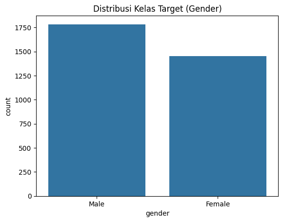
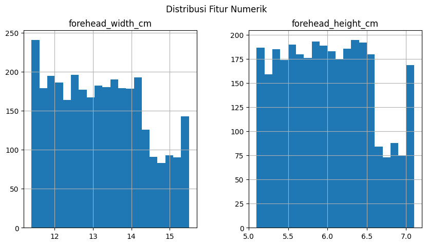
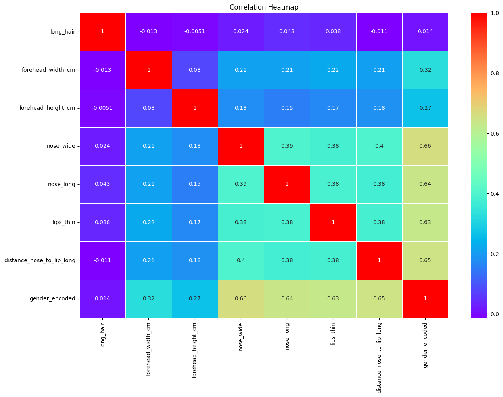

# **Prediksi Gender Berdasarkan Karakteristik Fisik**

## **Identitas**

- **Judul Proyek:** Prediksi Gender Berdasarkan Karakteristik Fisik
- **Dibuat Oleh:**
- **NIM:**
- **Kelas:**

---

## **Deskripsi Proyek**

Proyek ini bertujuan untuk membangun model klasifikasi berbasis **K-Nearest Neighbors (KNN)** untuk memprediksi gender seseorang berdasarkan karakteristik fisik seperti lebar dahi, tinggi dahi, dan fitur lainnya. Model ini dilatih menggunakan dataset yang sudah diproses dan dievaluasi menggunakan berbagai metrik performa.

---

## **Tujuan Proyek**

1. Mengembangkan model machine learning untuk prediksi gender.
2. Mengukur performa model menggunakan metrik seperti akurasi dan confusion matrix.
3. Membuat data uji sintetis untuk validasi model.
4. Deploy model menggunakan **Streamlit** sebagai aplikasi prediksi interaktif.

---

## **Alur Penyelesaian Proyek**

Berikut adalah diagram alur penyelesaian proyek:


---

## **Dataset**

- **Sumber Dataset:** Dataset dibuat secara internal untuk proyek ini.
- **Fitur Dataset:**
  1. `forehead_width_cm`
  2. `forehead_height_cm`
  3. `long_hair`
  4. `nose_wide`
  5. `nose_long`
  6. `lips_thin`
  7. `distance_nose_to_lip_long`
  8. `gender` (target)

---

## **Exploratory Data Analysis (EDA)**

**Tujuan EDA:**

1. Memahami distribusi data setiap fitur.
2. Mengidentifikasi pola, outlier, dan hubungan antar fitur.
3. Mengetahui distribusi kelas target (`gender`).

### **1. Distribusi Kelas Target (`gender`)**

- Visualisasi menggunakan **bar plot**:



**Hasil:** Kelas target seimbang antara 0 (Perempuan) dan 1 (Laki-laki).

### **2. Distribusi Fitur Numerik**

- **Histogram** digunakan untuk melihat distribusi fitur numerik seperti `forehead_width_cm` dan `forehead_height_cm`:



**Hasil:** Sebagian besar data fitur numerik terdistribusi normal.

### **3. Analisis Korelasi**

- Korelasi antara fitur numerik dapat divisualisasikan menggunakan **heatmap**:
  
  **Hasil:**
  - Tidak ada korelasi yang sangat tinggi di antara fitur numerik.
  - Korelasi rendah antar fitur menunjukkan relevansi masing-masing fitur terhadap target.

### **4. Outlier Detection**

.png>)

- Deteksi outlier dilakukan menggunakan **boxplot**:

  **Hasil:** Beberapa outlier terdeteksi, tetapi masih dalam batas yang wajar.

---

## **Proses Preprocessing Data**

1. **Normalisasi:**  
   Semua fitur numerik (`forehead_width_cm`, `forehead_height_cm`, dll.) dinormalisasi menggunakan **StandardScaler**.
2. **Encoding Kategori:**  
   Fitur seperti `long_hair` dan `nose_wide` diencoding menjadi nilai biner (1 untuk "Ya", 0 untuk "Tidak").

---

## **Proses Learning / Modeling**

**Algoritma yang Digunakan:**

- **K-Nearest Neighbors (KNN)**

**Langkah Pelatihan Model:**

1. Dataset dibagi menjadi **60% data latih** dan **40% data uji**.
2. Normalisasi dilakukan pada data latih dan uji.
3. Model dilatih menggunakan algoritma KNN dengan parameter default.

```python
from sklearn.neighbors import KNeighborsClassifier
knn = KNeighborsClassifier()
knn.fit(X_train, Y_train)
```

---

## **Evaluasi Model**

**Hasil Evaluasi:**

- **Akurasi:** 97.6%
- **Confusion Matrix:**

  ```
  [[550  20]
   [ 37 687]]
  ```

- **Classification Report:**
  ```
  precision    recall  f1-score   support
       0       0.94      0.96      0.95       570
       1       0.97      0.95      0.96       724
  ```

**Visualisasi Confusion Matrix:**

.png>)

---

## **Diskusi dan Kesimpulan**

**Diskusi:**

- Model KNN memberikan akurasi tinggi (97.6%) dalam memprediksi gender.
- Terdapat sedikit kesalahan prediksi, terlihat dari **false positives (20)** dan **false negatives (37)**.

**Kesimpulan:**

- Model berhasil memprediksi gender dengan akurasi tinggi.
- Implementasi dapat diperluas untuk penggunaan di dunia nyata, dengan memperbesar dataset untuk validasi lebih lanjut.

---

## **Deployment**

Model ini dideploy menggunakan **Streamlit**. Anda dapat mengakses aplikasi prediksi interaktif melalui tautan berikut:  
[Link Aplikasi Streamlit](https://streamlit.io)

---
